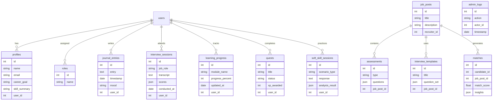

# CareerOS: System Design & Implementation Plan

## Overview

CareerOS is an AI-powered full-stack career management platform combining personalized learning, job readiness assessment, recruiter insights, and career forecasting tools. This document breaks the system into clear modules, defines core workflows, and outlines implementation details. It is structured for practical development in a monorepo setup with React (frontend), Spring Boot (backend), and FastAPI (AI/ML), integrated via PostgreSQL (Supabase-compatible).

---

## Table of Contents

1. [System Architecture Overview](#system-architecture-overview)
2. [Modules and Workflows](#modules-and-workflows)
3. [Module 1: User Management](#module-1-user-management)
4. [Module 2: AI Interview Simulator](#module-2-ai-interview-simulator)
5. [Module 3: Learning Path Engine](#module-3-learning-path-engine)
6. [Module 4: FutureCast Career Simulator](#module-4-futurecast-career-simulator)
7. [Module 5: SkillForge Gamified Learning](#module-5-skillforge-gamified-learning)
8. [Module 6: MindFlow Soft Skill Trainer](#module-6-mindflow-soft-skill-trainer)
9. [Module 7: LifeScript Journal](#module-7-lifescript-journal)
10. [Module 8: Recruiter Tools](#module-8-recruiter-tools)
11. [Module 9: Admin & Analytics Tools](#module-9-admin--analytics-tools)
12. [Technology Stack](#technology-stack)
13. [Future Enhancements](#future-enhancements)

---

## System Architecture Overview

* **Frontend**: React (Vite), Tailwind CSS, Axios for API calls.
* **Backend**: Java Spring Boot (REST APIs), PostgreSQL (JPA + Hibernate)
* **AI/ML Service**: Python FastAPI (model inference, NLP, recommendation, scoring)
* **Communication**:

  * Frontend → Spring Boot
  * Spring Boot → FastAPI (AI engine)
* **CI/CD**: Render/Netlify for free tier hosting with GitHub Actions
* **Auth**: JWT-based (Supabase/Custom)

---

## Modules and Workflows

| Module                    | Purpose                                       |
| ------------------------- | --------------------------------------------- |
| 1. User Management        | Registration, login, role-based access        |
| 2. AI Interview Simulator | Mock interviews with feedback                 |
| 3. Learning Path Engine   | Personalized skill roadmap generator          |
| 4. FutureCast             | Career simulation with decision forecasting   |
| 5. SkillForge             | Gamified learning & XP system                 |
| 6. MindFlow               | Soft skill trainer with NLP                   |
| 7. LifeScript             | AI-powered journaling dashboard               |
| 8. Recruiter Tools        | Job posting, smart matching, interview tools  |
| 9. Admin Panel            | Analytics, user moderation, config management |

---

## Module 1: User Management

### Features:

* Registration (Anonymous → Candidate)
* Role-Based Access (Candidate, Recruiter, Admin)
* Profile setup with onboarding form
* JWT Authentication & Middleware

### Backend:

* `UserController` for auth
* `UserService`, `RoleService`, `AuthService`
* `User`, `Role`, `Profile` entities

### Frontend:

* Forms: Signup, Login, Onboarding Form
* Dashboard redirection based on role

### Database:

* Tables: `users`, `roles`, `profiles`

---

## Module 2: AI Interview Simulator

### Features:

* Role-specific question generation
* Real-time AI evaluation: fluency, logic, relevance
* Scoring + Feedback
* Auto-updates user performance profile

### Backend:

* Endpoint: `POST /interview/start`
* Save: `interview_sessions`, `answers`, `scores`

### FastAPI:

* LLM prompt generation
* Response scoring pipeline (grammar, coherence, emotion)

### Frontend:

* Mic or text input interface
* Animated AI interviewer
* Feedback dashboard post-session

---

## Module 3: Learning Path Engine

### Features:

* Personalized learning roadmap
* Links to external resources (e.g., Coursera, YouTube)
* AI recommendations from interview performance

### Backend:

* `LearningPathController`
* Tables: `learning_paths`, `resources`, `user_learning`

### FastAPI:

* NLP + Embedding similarity for content matching
* Skill-gap inference based on session data

### Frontend:

* Progress bar
* Resource carousel
* XP earned per module

---

## Module 4: FutureCast Career Simulator

### Features:

* Decision-tree interface
* Predicts income, happiness, burnout risk
* Based on user + market data

### Backend:

* Endpoint: `GET /simulation/options`, `POST /simulation/choice`
* Logic module for scenario branching

### FastAPI:

* Predictive model based on regression/classification
* Behavioral and economic parameter estimators

### Frontend:

* Interactive UI with visual projections (e.g., salary chart)

---

## Module 5: SkillForge Gamified Learning

### Features:

* XP and badge system
* Quests from learning path
* Rewards and leaderboard

### Backend:

* `GamificationService`
* Tables: `quests`, `xp_logs`, `badges`

### Frontend:

* Gamified UI: XP bar, Quest list
* Notifications for rewards

---

## Module 6: MindFlow Soft Skill Trainer

### Features:

* Roleplay simulator (negotiation, conflict resolution)
* NLP-based response scoring and suggestions

### FastAPI:

* Emotion detection
* Dialogue act classification
* Paraphrase + Sentiment analysis

### Frontend:

* Conversational interface
* Feedback visualization (gauge, heatmap)

---

## Module 7: LifeScript Journal

### Features:

* Daily reflections: mood, wins, decisions
* AI summary generation
* Burnout prediction, future blockers

### Backend:

* Table: `journals`, `mood_logs`, `summaries`
* `LifeScriptService`

### FastAPI:

* Sentiment analysis
* Career narrative builder (summarization)

### Frontend:

* Dashboard-style journal
* AI-generated insights

---

## Module 8: Recruiter Tools

### Features:

* Job post creation with AI assessment generation
* Candidate matching with explainable scores
* Async video interview with AI grading

### Backend:

* Tables: `job_posts`, `candidate_rankings`, `interview_templates`
* Services: `MatchingEngineService`, `InterviewScorerService`

### FastAPI:

* Embedding-based candidate-job match
* Interview scoring: emotion, confidence, relevance

### Frontend:

* Dashboard with filters, insights
* Candidate shortlisting panel

---

## Module 9: Admin & Analytics Tools

### Features:

* User monitoring & moderation
* Platform usage analytics
* AI configuration and feedback collection

### Backend:

* Admin endpoints: `DELETE /user/{id}`, `GET /analytics`
* Tables: `system_logs`, `ai_feedback`

### Frontend:

* Admin panel with search and filter
* Analytics charts

---

## Technology Stack

| Layer      | Tech Stack                                  |
| ---------- | ------------------------------------------- |
| Frontend   | React (Vite), Tailwind CSS                  |
| Backend    | Java Spring Boot, JPA, Hibernate            |
| AI Service | FastAPI (Python), Transformers              |
| Database   | PostgreSQL (via Supabase-compatible schema) |
| CI/CD      | GitHub Actions + Render/Netlify             |
| Auth       | JWT + Role Middleware                       |
| LLM        | OpenAI / Gemini API                         |

---

## Future Enhancements

* Real-time mentor chat integration
* Blockchain certificate validation
* Mental health tracking via wearable APIs
* LLM fine-tuning for custom interview models

---

*(End of Part 1)*

## Deployment Plan

### Monorepo Structure

```
careeros/
├── frontend/             # Vite + React + Tailwind
├── backend/              # Spring Boot (Java)
├── ai-service/           # FastAPI (Python)
├── shared/               # Shared configs, data models (optional)
├── docker/               # Dockerfiles, docker-compose
├── .github/workflows/    # CI/CD pipelines
```

### Hosting

* **Frontend**: Netlify / Render
* **Backend**: Render (Spring Boot as web service)
* **AI Service**: Render (FastAPI as microservice)
* **Database**: Supabase (PostgreSQL)

### CI/CD Steps

1. **Push to **\`\`** branch triggers workflow**
2. **Frontend**: Deploy via Netlify build hook
3. **Backend**: Deploy Spring Boot to Render
4. **AI Service**: Deploy FastAPI to Render
5. **Shared environment**:

   * `.env` for frontend and backend
   * Secrets managed via Render / Netlify Dashboard

### Docker (for local/dev use)

```yaml
docker-compose.yml:
  services:
    frontend:
      build: ./frontend
      ports:
        - "5173:5173"
    backend:
      build: ./backend
      ports:
        - "8080:8080"
    ai-service:
      build: ./ai-service
      ports:
        - "8000:8000"
    db:
      image: postgres
      ports:
        - "5432:5432"
```

---

## API Design

### User Management (Spring Boot)

| Method | Endpoint       | Description                    |
| ------ | -------------- | ------------------------------ |
| POST   | /auth/register | Register new user              |
| POST   | /auth/login    | Authenticate user & return JWT |
| GET    | /user/profile  | Get logged-in user profile     |
| PUT    | /user/profile  | Update user profile            |

### Interview Simulator (FastAPI via Spring Boot proxy)

| Method | Endpoint            | Description                  |
| ------ | ------------------- | ---------------------------- |
| POST   | /interview/start    | Start interview session      |
| POST   | /interview/submit   | Submit answer for evaluation |
| GET    | /interview/feedback | Retrieve feedback            |

### Learning Path Engine

| Method | Endpoint           | Description                    |
| ------ | ------------------ | ------------------------------ |
| GET    | /learning/path     | Get personalized learning path |
| POST   | /learning/progress | Update progress in module      |

### FutureCast

| Method | Endpoint            | Description                        |
| ------ | ------------------- | ---------------------------------- |
| GET    | /futurecast/options | Retrieve decision options          |
| POST   | /futurecast/choose  | Submit choice and receive outcomes |

### SkillForge

| Method | Endpoint             | Description             |
| ------ | -------------------- | ----------------------- |
| GET    | /skillforge/quests   | Get user quests         |
| POST   | /skillforge/complete | Submit quest completion |

### MindFlow

| Method | Endpoint          | Description                 |
| ------ | ----------------- | --------------------------- |
| POST   | /mindflow/start   | Start soft skill scenario   |
| POST   | /mindflow/respond | Submit reply for evaluation |

### LifeScript

| Method | Endpoint            | Description                 |
| ------ | ------------------- | --------------------------- |
| POST   | /lifescript/log     | Add journal entry           |
| GET    | /lifescript/summary | Get AI-generated reflection |

### Recruiter Tools

| Method | Endpoint                    | Description               |
| ------ | --------------------------- | ------------------------- |
| POST   | /recruiter/job-post         | Post job                  |
| GET    | /recruiter/match            | Get matched candidates    |
| POST   | /recruiter/assessment       | Create custom test        |
| POST   | /recruiter/interview/setup  | Configure async interview |
| GET    | /recruiter/interview/report | Get AI-evaluated results  |

### Admin Panel

| Method | Endpoint         | Description               |
| ------ | ---------------- | ------------------------- |
| GET    | /admin/users     | List all users            |
| DELETE | /admin/user/{id} | Remove a user account     |
| GET    | /admin/analytics | Platform-wide usage stats |


---

## Entity Relationship Diagram (ERD)



This ERD visualizes the key relationships among users, profiles, learning, interviews, jobs, and analytics. It supports modular development and horizontal scaling.

---

## Sequence Diagrams

### 1. AI Interview Simulation


### 2. Career Simulation (FutureCast)


### 3. Smart Candidate Matching


---

## Mock Data Templates

### User (Candidate)

```json
{
  "name": "Aisha Rahman",
  "email": "aisha@example.com",
  "role": "candidate",
  "career_goal": "Data Scientist",
  "skills": ["Python", "Statistics", "ML"],
  "profile_complete": true
}
```

### Job Post

```json
{
  "title": "Junior Backend Developer",
  "description": "Spring Boot + PostgreSQL",
  "skills_required": ["Java", "JPA", "REST APIs"],
  "recruiter_id": 5
}
```

### Interview Session

```json
{
  "user_id": 3,
  "job_role": "Frontend Engineer",
  "transcript": "I used React and Tailwind in my last project...",
  "scores": {
    "fluency": 8.5,
    "relevance": 9.0,
    "confidence": 7.8
  },
  "conducted_at": "2025-07-14T14:00:00Z"
}
```

### Quest (Gamified Learning)

```json
{
  "user_id": 3,
  "title": "Complete Java Basics Module",
  "status": "completed",
  "xp_awarded": 200
}
```

---

---

## Database Seeder Scripts

### SQL Seeder (PostgreSQL)

```sql
INSERT INTO roles (id, name) VALUES (1, 'candidate'), (2, 'recruiter'), (3, 'admin');

INSERT INTO users (id, name, email, role_id) VALUES
(1, 'Aisha Rahman', 'aisha@example.com', 1),
(2, 'Rehan Islam', 'rehan@hireco.com', 2);

INSERT INTO profiles (user_id, career_goal, skill_summary) VALUES
(1, 'Data Scientist', 'Python, ML, Statistics');

INSERT INTO job_posts (id, title, description, recruiter_id) VALUES
(1, 'Backend Developer', 'Work with Spring Boot and PostgreSQL', 2);

INSERT INTO interview_templates (job_post_id, title, question_set) VALUES
(1, 'Backend Role Interview', '["What is dependency injection?", "Explain REST vs SOAP."]');
```

---

## Test Cases

### Interview Simulator

**Test:** Candidate receives relevant questions

* Input: Role = "Data Scientist"
* Expected Output: At least 3 relevant questions containing ML/Data terms

**Test:** AI scoring returns valid JSON

* Input: "I have 2 years of experience in TensorFlow"
* Output: JSON with keys: `fluency`, `relevance`, `confidence`

### Learning Path

**Test:** Personalized modules generated

* Input: Candidate career goal = "Frontend Developer"
* Output: Learning path includes React, JavaScript, Tailwind

### Recruiter Matching

**Test:** Ranked results by match score

* Input: Recruiter selects skill = "Java"
* Output: Candidates sorted with match\_score field

---

## Integration Flowchart

To visualize the integration without Mermaid rendering issues, here's a text-based flowchart instead:

```
[Frontend (React)]
       |
       |  REST API Calls
       v
[Backend (Spring Boot)]
       |\
       | \
       |  > Proxy to AI API (/ai/*)
       |   
       v     
[FastAPI (Python AI Service)]
       |
       |  Direct DB Read/Write (e.g. analytics, logs)
       v
[PostgreSQL (Supabase DB)]
```

Alternatively, the corrected Mermaid block for future rendering support:

```mermaid
flowchart TD
  FE[Frontend (React)] -->|REST API| BE[Backend (Spring Boot)]
  BE -->|/ai/* proxy| AI[FastAPI AI Service]
  BE --> DB[(PostgreSQL / Supabase)]
  AI --> DB
```

---

(End of core planning document. All critical architecture, development, testing, and deployment plans are included.)
